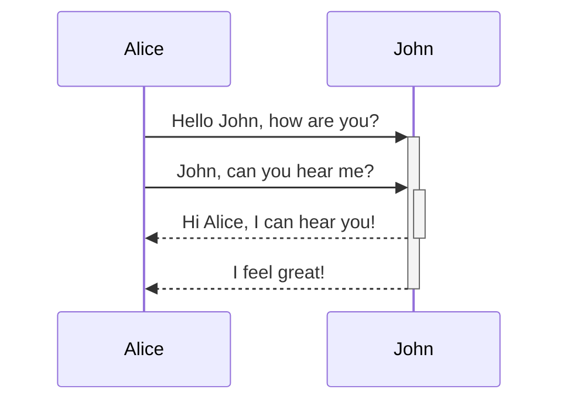

# This is a heading 1
## This is a heading 2
### This is a heading 3 
#### This is a heading 4
##### This is a heading 5
###### This is a heading 6

---

TEXT STYLES

**This is bold**
_This is italic_
**_This is bold and italic_**
~~Strikethrough~~
==Highlighted==

---

LISTS

Bulleted List
- Item
- Item
	- Child Item

Numbered List
1. Item
2. Item
	1. Child Item

---

IMAGES
Sized image:
![[NPC - Anas Ooma Veda.jpg|200]]

---

LINKS
[[Internal Link]]
[External Link](http://obsidian.md)

---

PARAGRAPH STYLES

`code block`

> Blockquote

---

TASK LIST
- [x] #tags, [links](), **formatting** supported
- [x] list syntax required (any unordered or ordered list supported)
- [x] this is a complete item
- [?] this is also a complete item (works with every character)
- [ ] this is an incomplete item
- [ ] tasks can be clicked in Preview to be checked off

---

TABLE
(with Advanced Tables plugin, begin a new table with | and press tab)

| Table | Header | Example |
| ----- | ------ | ------- |
| 1     | 2      | 3       |
| a     | b      | c       |

---

FOOTNOTES
(they appear at the bottom of the document)

Here's a simple footnote,[^1] and here's a longer one.[^bignote]

[^1]: meaningful!

[^bignote]: Here's one with multiple paragraphs and code.

    Indent paragraphs to include them in the footnote.

    `{ my code }`

    Add as many paragraphs as you like.
	
You can also use inline footnotes. ^[notice that the carat goes outside of the brackets on this one.]

	
---

COMMENTS
(use syntax mode to see it)

%% This text is visible in markdown, but hidden in the preview.%%

---

CALLOUT BOXES

> [!NOTE]
> Here's a Note block.

> [!ABSTRACT]
> Here's an Abstract block.
> SUMMARY and TLDR use the same style

> [!INFO]
> Here's an Info block.
> TODO uses the same style

> [!TIP]
> Here's a Tip block.
> HINT and IMPORTANT use the same style

> [!SUCCESS]
> Here's a Success block.
> CHECK and DONE use the same style

> [!QUESTION]
> Here's a Question block.
> HELP and FAQ use the same style

> [!WARNING]
> Here's a Warning block.
> CAUTION and ATTENTION use the same style

> [!FAILURE]
> Here's a Failure block.
> FAIL and MISSING use the same style

> [!DANGER]
> Here's a Danger block.
> ERROR uses the same style

> [!BUG]
> Here's a Bug block.

> [!EXAMPLE]
> Here's an Example block.

> [!QUOTE]
> Here's a Quote block.
> CITE uses the same style

> [!QUESTION] Custom Title
> Put a custom title into any callout type

> [!INFO]+ FOLDING CALLOUT - EXPANDED
> This text can be collapsed, but is expanded by default.

> [!WARNING]- FOLDING CALLOUT - COLLAPSED
> This text is collapsed by default.

---

DIAGRAM
Obsidian uses [Mermaid](https://mermaid-js.github.io/) to render diagrams and charts. Mermaid also provides [a helpful live editor](https://mermaid-js.github.io/mermaid-live-editor).

